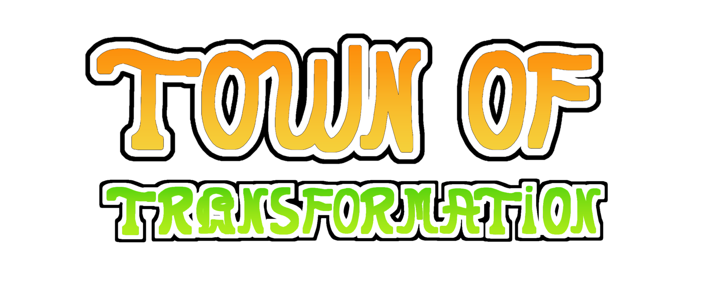

> [!NOTE]
> This mod would not have been possible without the support of [Pix](https://github.com/WanderingPix/) (@WanderingPix)!
> Also a lot of thanks to everyone that helped me in the [All Of Us Mods discord](https://discord.com/invite/FYYqJU2bvp) and the people over at the [TOU: Mira](https://github.com/AU-Avengers/TOU-Mira) development team!
> Also this thing is probably not gonna be developed a lot anymore as I've started working on [RFS](https://github.com/Reach-For-Stars-Team), a modpack including some fun stuff.

-----------------------

  
  
Tow Of Transformation

 

A client-side [Among Us](https://store.steampowered.com/app/945360/Among_Us) mod that adds some new roles and modifiers to [Town of Us: Mira](https://github.com/AU-Avengers/TOU-Mira), most of which can transform (kind of like Ssundee mods), hence the name.

-----------------------
# License
You can do anything with this thing BUT make sure to credit me and link [this repo](https://github.com/am-clonec/town-of-transformation)

# Copyright

This mod is not affiliated with Among Us or Innersloth LLC, and the content contained therein is not endorsed or otherwise sponsored by Innersloth LLC. Portions of the materials contained herein are property of Innersloth LLC.

© Innersloth LLC.

